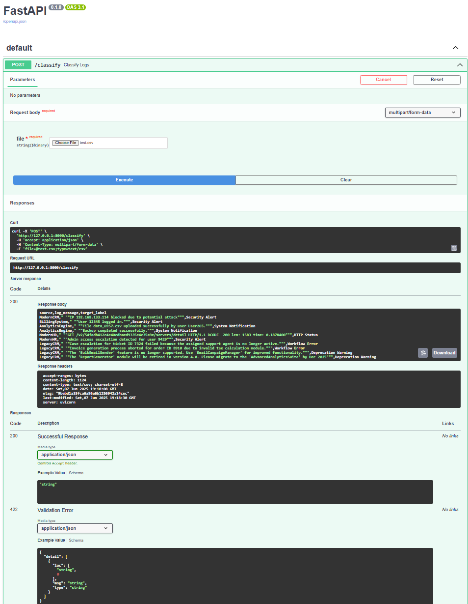

# 🚀 Log Classification System Using Hybrid Engine

This project delivers a **hybrid log classification system** that blends three complementary techniques to tackle the full spectrum of log data — from simple to ambiguous patterns.  
🔧 Built for **flexibility**, ⚡ tuned for **performance**.

---

## 🧠 Classification Strategies

1. 🔍 **Regex-Based Matching**
   - 🧾 For **simple and predictable** log formats.
   - ⚡ Blazing fast via predefined rules.

2. 🧬 **Sentence Transformers + Logistic Regression**
   - 🧠 Great for **mid-complexity logs** with labeled data.
   - 🧱 Uses **transformers for embeddings**, then a classic **logistic classifier**.

3. 🧠💡 **Large Language Models (LLMs)**
   - 🧠 For **fuzzy, ambiguous logs** where labeled data is scarce.
   - 🛡️ Acts as a **fallback** for cases that Regex or Sentence Transformers can't handle.

📌 System Architecture:


---

## 📁 Project Structure

```bash
├── notebook/          # 🏋️‍♂️ Training scripts (Sentence-BERT + LR + Regex)
├── models/            # 🧠 Saved models & embeddings
├── resources/         # 📂 Sample CSVs, diagrams, output files
├── server.py          # 🚀 FastAPI backend
├── requirements.txt   # 📦 Dependencies
---

## Getting Started

1. 🧪 **Install Dependencies**

    Ensure Python is installed. Then, install the required packages:

    ```bash
    pip install -r requirements.txt
    ```

2. 🔥 **Start the FastAPI Server**

    Launch the server with:

    ```bash
    uvicorn server:app --reload
    ```

    Access the API at:
    - `http://127.0.0.1:8000/`
    - `http://127.0.0.1:8000/docs` (Swagger UI) 🖥️
    - `http://127.0.0.1:8000/redoc` (ReDoc UI) 📘

---


## How to Use 📤

Upload a CSV file with logs to the FastAPI endpoint for classification. The CSV should include these columns:
- `source`
- `log_message`

The response will be a CSV file with an added `target_label` column, indicating the predicted label for each log entry.

---
